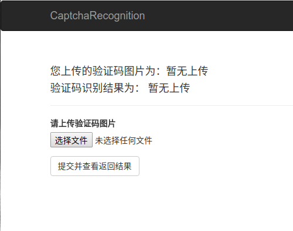
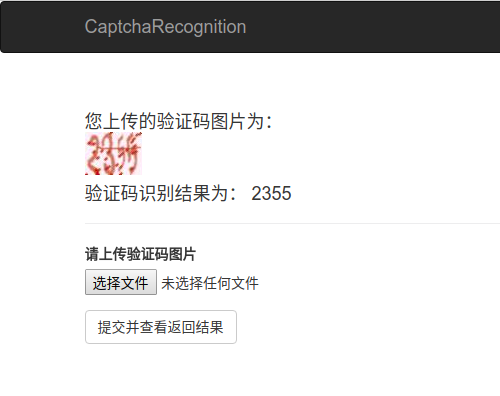

#### 文档目录结构

>│CaptchaRecognition
>
>├── README.md
>
>├── 作业文档.ipynb
>
>├── code
>
>│		├── web				# Web api
>
>│		│		├── templates		# 网页模板
>
>│		│		│		├── 404.html	# 自定义404页面，扩展base.html
>
>│		│		│		├── 500.html	# 自定义500页面，扩展base.html
>
>│		│		│		├── base.html	# 扩展bootstrap/base.html页面内容
>
>│		│		│		├── index.html	# 经渲染的表单，扩展base.html，即实际显示的web界面		
>
>│		│		├── manage.py		# 启动文件
>
>│		│		├── result.py			# 导入模型进行识别
>
>│		├── cnn.ipynb				# 模型设计、训练、验证，可视化
>
>│		├── data_tfrecords.ipynb		# 统计数据，制作tfrecord文件
>
>│		├── read_data.ipynb			# 使用tfrecord文件
>
>│		├── read_data.py				# 同read_data.ipynb，便于导入

附web界面图：

1.识别前

2.识别后

